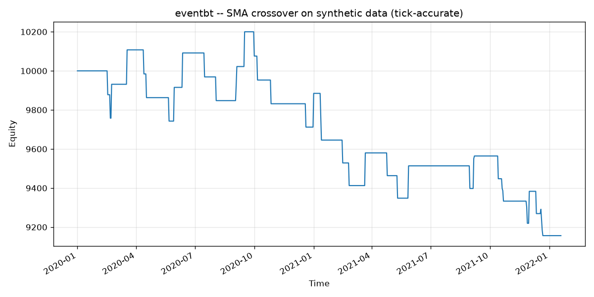

<!-- Переключатель языка -->
[English](README.md) | **Русский**

# event-backtester (`eventbt`)

[](https://www.python.org/)
[](LICENSE)
[](https://github.com/astral-sh/ruff)
[](https://mypy-lang.org/)
[](https://github.com/stasoctopus/event-backtester/actions/workflows/ci.yml)

**Событийный, tick-accurate движок для бэктестинга** на Python. Сигналы стратегии
рассчитываются на грубом ряду баров, а исполнение ордеров и брекет-ордера разрешаются
на более мелком ряду тиков — поэтому внутрибарные выходы отражают *реальный* порядок,
в котором цена касалась уровней, а не оптимистичную догадку по бару.

> Вдохновлено продакшн-системой трейдинга, которую я держу на VPS.



*Кривая капитала демо-стратегии SMA-кроссовера на синтетических данных
(воспроизводимо при `seed=7`). У демо-стратегии **нет альфы** — она нужна лишь чтобы
прогнать движок.*

---

## Почему такие решения?

Бэктест надёжен ровно настолько, насколько надёжна его модель исполнения. Три решения
определяют архитектуру движка; каждое убирает типичный способ, которым бэктест «врёт».

### 1. Tick-accurate филлы (борьба с внутрибарным fill bias)

Когда и стоп-лосс, и тейк-профит попадают в диапазон high–low одного бара,
бар-ориентированный бэктест **не может знать, что сработало первым**. Большинство
библиотек молча трактуют неоднозначность в пользу стратегии — и завышают результат.

Этот движок воспроизводит **реальный порядок тиков** внутри бара: какого уровня цена
достигла первым, тот и закрывает позицию, отменяя второй (настоящий one-cancels-other).
Юнит-тест [`tests/test_fills.py`](tests/test_fills.py) фиксирует это на управляемом
сценарии:

| | Стоп @ 99 | Тейк @ 102 | Результат |
|---|---|---|---|
| Порядок тиков `100 → 99.5 → **99** → 100.5 → 102` | достигнут **первым** | достигнут позже | **−1.00 / лот (убыток)** |
| Наивное бар-правило (оба в диапазоне → считаем тейк) | игнор | считается первым | **+2.00 / лот (прибыль)** |

Один и тот же бар — противоположные выводы. Движок отказывается записывать фантомную
прибыль.

Демо показывает тот же эффект на полном прогоне — бар-ориентированное исполнение
выглядит «красивее» по всем метрикам (см. сравнение ниже).

### 2. Сайзинг позиции на основе риска

Размер позиции выводится из риск-бюджета счёта, а не из фиксированного числа лотов:

```
lots = floor(balance * risk_pct / (stop_distance * point_value))
```

Так каждая сделка рискует примерно одинаковой долей капитала независимо от ширины
стопа. Число лотов ограничивается диапазоном `[0, max_lots]`; сделка, для которой
риск-бюджета не хватает даже на один лот, пропускается, а не форсируется.

### 3. Методология против переобучения

Библиотека даёт инструменты, чтобы валидировать стратегию честно, а не просто подогнать:

- **Разбиение in-sample / out-of-sample** — `train_test_split` для слепого hold-out.
- **Скользящий walk-forward** — `walk_forward` подбирает параметры на каждом окне
  in-sample и оценивает победителя *только* на следующем, ранее не виденном окне
  out-of-sample, затем сшивает OOS-сегменты в одну непрерывную кривую капитала.

### Что пробовал и отбросил (честный отрицательный результат)

Я оценил ML-фильтр сигналов (градиентный бустинг на инженерных признаках) для отсева
входов. Его **out-of-sample AUC оказался ≈ 0.53** — статистически неотличимо от
подбрасывания монеты — поэтому он был отклонён. Смысл именно в том, чтобы сообщить
отрицательный результат: фильтру, который не обобщается, нет места в бэктесте, как бы
хорошо он ни выглядел на in-sample.

---

## Результаты демо

Запуск `python examples/run_demo.py` (синтетические данные GBM, `seed=7`, ~3 года
дневных баров, демо SMA-кроссовер) печатает две таблицы метрик — tick-accurate прогон
и бар-ориентированное приближение, которое видит лишь одну цену на бар:

| Метрика | Tick-accurate | Только бар (по close) |
|---|---:|---:|
| Total Return % | **−8.44** | −7.32 |
| Win Rate % | 32.35 | 33.33 |
| Profit Factor | 0.69 | 0.72 |
| Max Drawdown % | −10.23 | −11.57 |
| Sharpe | **−0.61** | −0.45 |
| Calmar | −0.29 | −0.22 |
| Positive Months % | 29.17 | 29.17 |
| Trades | 34 | 33 |

Бар-ориентированная колонка показывает более высокую доходность, лучший Sharpe и лучший
profit factor — ровно тот системный оптимизм, против которого построен этот движок.
(Стратегия теряет деньги в обоих случаях; у неё нет альфы, и это нормально — предмет
здесь сам движок.)

---

## Установка

```bash
git clone https://github.com/stasoctopus/event-backtester.git
cd event-backtester
python -m venv .venv && source .venv/bin/activate
pip install -e ".[dev,plot]"      # ядро + тесты/линт/типы + графики
```

`numpy` и `pandas` — единственные runtime-зависимости. `matplotlib` (графики) и
`yfinance` (опциональный загрузчик публичных данных) — это extras:
`pip install -e ".[plot,data]"`.

## Быстрый старт

```python
from eventbt import gbm_data, SMACrossover, EngineConfig, run_backtest, summary_table

# 1. Синтетический воспроизводимый рынок: тики GBM, агрегированные в согласованные OHLC-бары.
bars, ticks = gbm_data(n_bars=750, ticks_per_bar=60, sigma=0.25, seed=7, bar_freq="1D")

# 2. Стратегия возвращает Signal (направление + дистанции стоп/тейк); движок их сайзит.
strategy = SMACrossover(fast=10, slow=40, stop_distance=0.5, take_distance=1.0)

# 3. Прогон с реалистичными издержками.
config = EngineConfig(initial_balance=10_000, risk_pct=0.01, point_value=1.0,
                      spread=0.02, commission=0.05)
result = run_backtest(strategy, bars, ticks, config)

print(summary_table(result))
print(result.trades_frame().head())
```

Полное демо (печатает таблицы, сохраняет `docs/equity_curve.png`):

```bash
python examples/run_demo.py
```

## Walk-forward

```python
from eventbt import gbm_data, SMACrossover, walk_forward, total_return

bars, ticks = gbm_data(n_bars=2000, ticks_per_bar=30, seed=1)

wf = walk_forward(
    bars, ticks,
    strategy_factory=lambda fast, slow: SMACrossover(fast, slow, 0.5, 1.0),
    param_grid={"fast": [5, 10], "slow": [20, 40]},
    objective=lambda res: total_return(res.equity_curve),  # максимизируется на in-sample
    train_size=400, test_size=100, step=100,
)
print(wf.best_params)                 # параметры, выбранные по окнам
print(len(wf.stitched_equity))        # непрерывная out-of-sample кривая капитала
```

---

## Архитектура

```
                сигналы (грубые бары)          филлы + брекет (мелкие тики)
 Strategy  ───────────────────────────►  Backtester  ◄───────────────────────────  ticks
 (on_bar → Signal)                          │
                                            ├─ size_position()  лоты по риску
                                            ├─ OCO-брекет       выходы по порядку тиков
                                            ├─ costs            spread + commission
                                            └─ mark-to-market   кривая капитала
                                            │
                                            ▼
                                       BacktestResult ──►  metrics / walk_forward
```

| Модуль | Зона ответственности |
|---|---|
| `eventbt.data` | `Bar`/`Tick`, колоночные `BarSeries`/`TickSeries`, генератор `gbm_data`, `load_yfinance` |
| `eventbt.strategy` | ABC `Strategy`, `Signal`, демо `SMACrossover` |
| `eventbt.engine` | `Backtester`, `EngineConfig`, `size_position`, OCO-филлы, `Trade`, `BacktestResult` |
| `eventbt.metrics` | доходность, win rate, profit factor, max drawdown, Sharpe, Calmar, % плюсовых месяцев |
| `eventbt.walkforward` | `generate_windows`, `train_test_split`, `walk_forward` |

**Порядок операций на каждом баре:** ① заполнить отложенный вход на *первом тике
следующего бара* (вход по close сигнального бара был бы look-ahead); ② просканировать
тики бара по порядку и разрешить OCO-брекет; ③ mark-to-market по close бара; ④ запросить
новый сигнал только когда позиции нет. Стратегия получает *усечённый срез* баров, поэтому
look-ahead bias невозможен by design. Тики группируются к барам один раз через
`np.searchsorted` (O(n log n)).

Решение по охвату: одна позиция за раз. Это сохраняет учёт прозрачным и задокументировано,
а не спрятано.

## Метрики

Все метрики — чистые функции; коэффициент годовой нормировки (`periods_per_year`, по
умолчанию 252) всегда задаётся явно и никогда не выводится из таймстемпов, поэтому
результаты воспроизводимы. Безрисковая ставка принимается нулевой.

- **Total Return** `equity[-1] / equity[0] − 1`
- **Win Rate** прибыльные сделки / все сделки
- **Profit Factor** валовая прибыль / валовый убыток (`inf`, если нет убытков)
- **Max Drawdown** худшая просадка пик-впадина по кривой капитала
- **Sharpe** `mean(r) / std(r, ddof=1) * sqrt(periods_per_year)`
- **Calmar** годовой CAGR / |max drawdown|
- **Positive Months %** доля календарных месяцев с положительной доходностью (ресемпл `ME`)

## Тестирование

```bash
pytest                       # 41 тест; equity/сайзинг/филлы/OCO/метрики/данные/walk-forward
ruff check . && ruff format --check .
mypy src
```

Набор использует посчитанные вручную векторы известных входов (например, Sharpe для
доходностей `[0.01, 0.02, 0.01, 0.02]` ≈ 41.25, что проверяет годовую нормировку и
`ddof`) и управляемый сценарий tick-accuracy выше. CI прогоняет те же проверки на
Python 3.10–3.13.

## Ограничения

- Только синтетические демо-данные; загрузчик `yfinance` возвращает бары, поэтому для
  tick-accurate исполнения на реальных данных нужно подать более мелкий ряд тиков.
- Одна открытая позиция за раз; портфеля одновременных позиций нет.
- Не является финансовой рекомендацией. Включённая стратегия — демо без альфы.

## Лицензия

[MIT](LICENSE)
